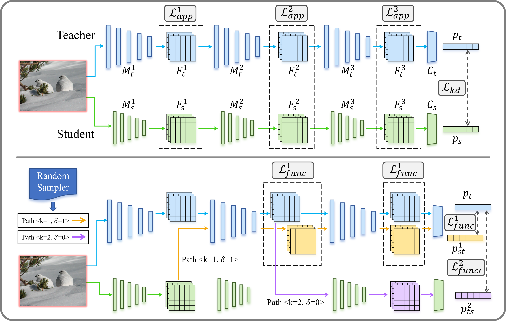

# [Function-Consistent Feature Distillation (ICLR 2023)](https://openreview.net/forum?id=pgHNOcxEdRI)

Official PyTorch implementation of our paper "Function-Consistent Feature Distillation".

## Introduction

FCFD is a feature distillation strategy. It takes the neural network's *anisotropic* usage of intermediate features into consideration, and correspondingly uses the later layers of the teacher and the student networks as the lens to measure and optimize the *functional* similarity between intermediate features.

<p align="center">
 
</p>

## Codes

For Image Classification, see [classification](./classification). 

For Object Detection, see [detection](./detection).

## Citation

If you find this work helpful for your research, please consider citing our paper:

```
@inproceedings{liu2023functionconsistent,
    title={Function-Consistent Feature Distillation},
    author={Dongyang Liu and Meina Kan and Shiguang Shan and Xilin CHEN},
    booktitle={The Eleventh International Conference on Learning Representations (ICLR) },
    year={2023},
    url={https://openreview.net/forum?id=pgHNOcxEdRI}
}
```

